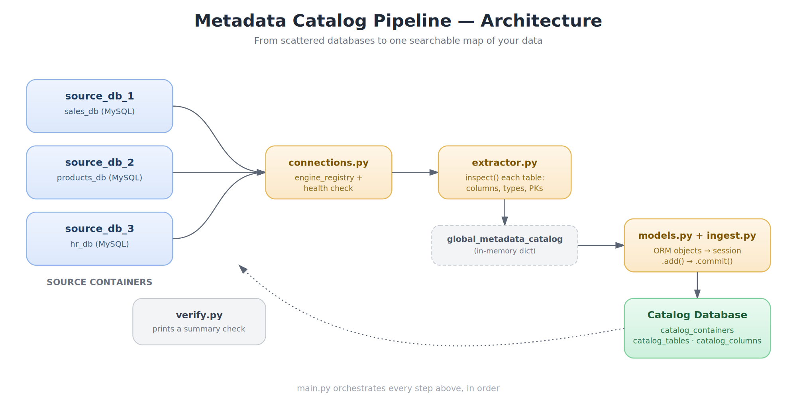
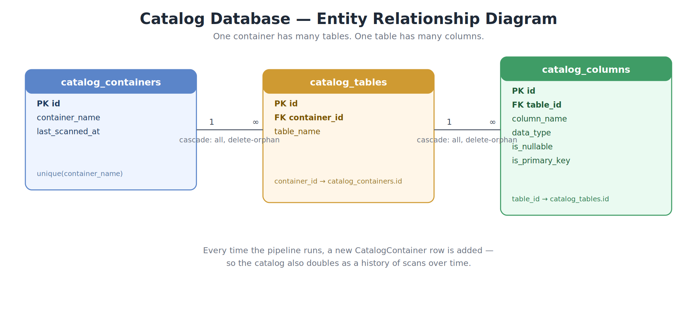

# I Got Tired of Asking "Wait, Which Database Has That Table?" — So I Built a Metadata Catalog

If you've worked with more than one database in a project, you know this moment: someone asks *"hey, which database has the customer email column?"* and you find yourself opening three different connections, clicking through schemas, and squinting at table names hoping something rings a bell.

I hit this enough times that I decided to fix it properly. So I built a small pipeline that does one job really well: it scans every database I have, figures out their structure, and stores that structure in one central place I can actually search. A **metadata catalog**.

This post walks through what it does, how it's built, and the database design behind it — diagrams included, so you don't have to take my word for any of it.

---

## The Problem, in Plain Terms

Picture three separate databases — say, `sales_db`, `products_db`, and `hr_db`. Each one has its own tables, its own columns, its own quirks. There's no single map that tells you "table X with column Y lives in database Z."

That's not a huge deal with one database. It becomes a real problem once you have several, especially in any setup with microservices, multiple environments, or a growing data team where nobody has the whole picture memorized.

The fix isn't complicated in concept: **scan every database, write down what you find, and keep that record somewhere queryable.** That "somewhere" is itself just... another database. A catalog database.

---

## How the Pipeline Works

Here's the full flow, end to end:



Walking through it left to right:

1. **Connect** — `connections.py` builds a SQLAlchemy engine for every source database, plus one for the catalog database itself, and runs a quick `SELECT 1` health check on each so a dead connection fails loudly and early instead of silently later.
2. **Extract** — `extractor.py` uses SQLAlchemy's `inspect()` to walk every table in a database and pull out its columns, data types, nullability, and primary keys. No raw data is ever read — only structure.
3. **Hold in memory** — the result is a plain Python dictionary, keyed by database name, holding everything just extracted. Nothing is written yet; this is just a snapshot.
4. **Ingest** — `models.py` defines the catalog's own schema (more on that below), and `ingest.py` converts that in-memory snapshot into actual rows in the catalog database, inside a single transaction — if anything fails partway, it rolls back instead of leaving a half-written catalog.
5. **Verify** — `verify.py` runs a quick read-back, so you immediately see what got stored.

`main.py` just calls these five steps in order. Nothing in this pipeline is clever — that's the point. Each piece does one job, and you could swap any one of them out without touching the rest.

---

## The Catalog's Own Database Design

The catalog needs somewhere to put what it learns, so it has its own three-table schema:



The relationships are deliberately simple:

- **`catalog_containers`** — one row per database scanned, with a timestamp of when it was last scanned.
- **`catalog_tables`** — one row per table found inside a container, linked back via `container_id`.
- **`catalog_columns`** — one row per column found inside a table, linked back via `table_id`, recording its type, nullability, and whether it's a primary key.

It's a straightforward **one-to-many-to-many** chain: one container → many tables → many columns. Nothing fancier is needed, because the goal isn't to model business data — it's to model the *shape* of other databases. And because every scan inserts a fresh `catalog_containers` row, the catalog quietly doubles as a history: you can see how a database's structure changed over time, not just what it looks like today.

---

## A Design Decision Worth Calling Out: No Hardcoded Credentials

Early versions of this lived in a single notebook, with database passwords typed directly into a cell. That's fine for a five-minute experiment and a bad idea for anything that lives longer than that.

So credentials now live in environment variables, loaded through a `.env` file:

```python
def _require_env(key: str) -> str:
    value = os.environ.get(key)
    if value is None or value == "":
        raise EnvironmentError(f"Missing required environment variable: {key}")
    return value
```

This one small function does two useful things: it keeps secrets out of source control entirely, and it fails with a clear error message the moment something is missing — instead of a confusing connection error three steps later.

---

## Why Modules Instead of One Big Notebook

The original version of this was a single Jupyter notebook. It worked, but it had a familiar problem: to find one function, you scrolled. To check one config value, you scrolled. Notebooks are excellent for exploring data — plotting, poking at a dataframe, rerunning one cell at a time. They're less pleasant once the code becomes a repeatable pipeline rather than an experiment.

So the logic was split into focused modules — `config.py`, `connections.py`, `extractor.py`, `models.py`, `ingest.py`, `verify.py` — each with one clear responsibility, orchestrated by a single `main.py`. The win isn't aesthetic. It's that each file is now independently testable, the diffs in git are actually readable, and running the whole thing again is one command: `python main.py`.

---

## What This Pattern Is Actually Good For

This isn't a one-off script — it's a small instance of a pattern called **data cataloging**, which shows up at every scale:

- A two-person startup with three databases, just trying to remember what's where.
- A data platform team building a searchable inventory across hundreds of tables.
- Tools like DataHub, Amundsen, and OpenMetadata — all solving this same core problem, just at much larger scale.

Building a small version yourself is a genuinely good way to understand what those bigger tools are doing under the hood: connect, introspect, store, repeat.

---

## Try It Yourself

The full project — `config.py`, `connections.py`, `extractor.py`, `models.py`, `ingest.py`, `verify.py`, `main.py`, plus a ready-to-edit `.env.example` — is structured to run with:

```bash
pip install -r requirements.txt
cp .env.example .env   # fill in your real credentials
python main.py
```

If you've ever lost ten minutes hunting for which database has a particular column, this is the kind of small tool that pays for itself fast.

---

*If you build something similar — or spot a way to make this cleaner — I'd genuinely like to hear about it. Drop a comment or open an issue.*
